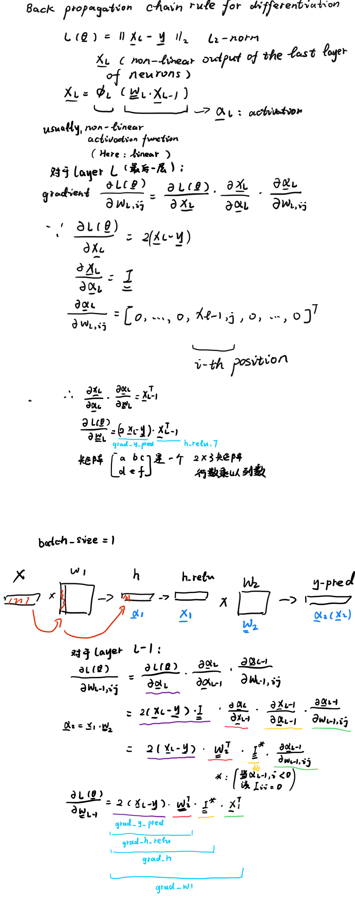

# From_TensorFlow2.0_to_PyTorch
这是一个中文Repo，记录我作为一个TensorFlow2.0用户学习PyTorch的过程。内容组织将包括: all codes from example, 对比一些TF2和PyTorch的API以及他们不同的behaviour，以及我的一些手工推导(不一定准确)。
这个Repo需要配合 [PyTorch Tutorials](https://pytorch.org/tutorials/)食用。
* Learning PyTorch
  * A 60 Minute Blitz
    * What's PyTorch
    * Autograd
    * Neural Networks
    * Training A Classifier
  * Learning PyTorch with Examples
  * What's torch.nn really?
  * Visualizing Models, Data, and Training with TensorBoard
* PyTorch Recipes

Example: 
Neural networks.ipynb

Training A Classifier.ipynb

Learning PyTorch with examples
